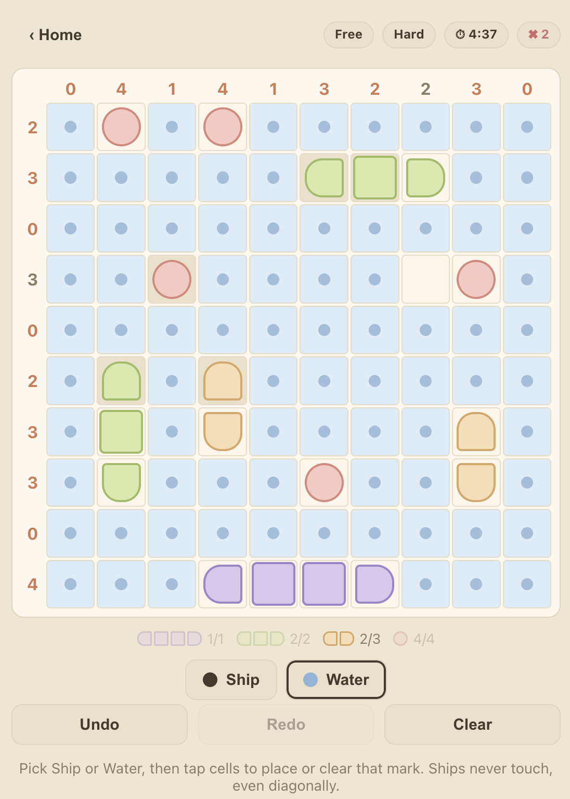

# Gamebox

A small browser-based collection of newspaper-style logic-puzzle games. It started as a recreation of The Economist's daily "inboxes" (Shikaku) puzzle and has since grown into a hub of games, each with unlimited auto-generated puzzles, a daily challenge, and personal stats.

## ▶️ Play

**[Play Gamebox →](https://matthewedwarddavidson.github.io/gamebox/)**

Pick a game from the hub:

- **Shikaku** — the classic [Shikaku](https://en.wikipedia.org/wiki/Shikaku)
  (as seen in The Economist's "inboxes"): partition the 8×12 grid into
  rectangles so each contains exactly one number equal to its area.
- **Battleships** — solitaire [Bimaru](<https://en.wikipedia.org/wiki/Battleship_(puzzle)>):
  locate the hidden fleet on a 10×10 grid using the ship counts along each row
  and column. Ships never touch, not even diagonally.


_Shikaku_


_Battleships_

## How puzzles are generated

Every puzzle is produced deterministically from a numeric **seed**, so the
engines are pure functions of that seed and the same seed always yields the
exact same puzzle.

- **Shikaku** recursively splits the grid into rectangles, places one clue per
  rectangle, and verifies the clue set has a unique solution — retrying with
  new sub-seeds until it does.
- **Battleships** places a random fleet (respecting the no-touch rule), derives
  the row/column counts, then reveals the minimal set of hint cells needed to
  make the solution unique before adding a few extra hints based on difficulty.

This keeps things simple and serverless:

- Each game's **daily challenge** derives its seed (and difficulty) from the UTC
  date, so everyone plays the same puzzle each day and past days can be
  revisited without storing any puzzle data.
- **Free play** just picks a random seed, giving an effectively unlimited supply
  of puzzles.

## Project layout

- `src/shell/` — the multi-game shell: game registry, hub screen, shared
  IndexedDB persistence, and cross-game state.
- `src/shared/` — utilities shared by every game (e.g. the seeded RNG).
- `src/games/<game>/` — one folder per game, each self-contained with:
  - `engine/` — pure, DOM-free game logic: puzzle generation, solver
    (uniqueness verification), rules/validation, and the daily puzzle.
  - `store/` — Zustand game state plus persistence and stats.
  - `ui/` — React UI: home, board, and stats screens.

## Local development

<!-- markdownlint-disable MD033 -->
<details>
<summary>Running the project locally</summary>

```sh
make start      # install deps (if needed) and launch the dev server
```

Then open http://localhost:5173/.

Other commands:

```sh
make test       # run the test suite
make build      # type-check and build the production bundle
make preview    # serve the production build
make typecheck  # run the TypeScript type checker
make lint       # run ESLint over the source
make clean      # remove node_modules and dist
make help       # list all commands
```

</details>
<!-- markdownlint-enable MD033 -->

## Continuous integration

Every push and pull request runs linting, type-checking and the full test
suite via the [CI workflow](.github/workflows/ci.yml). The
[deploy workflow](.github/workflows/deploy.yml) also lints, type-checks and
tests before building, so only passing code is published to GitHub Pages.
