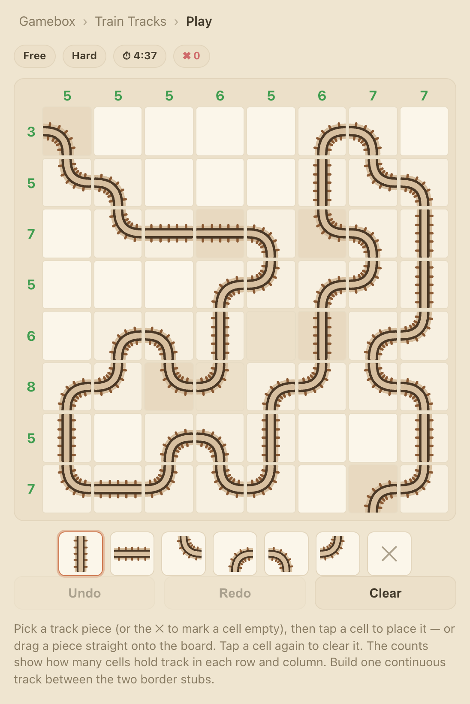
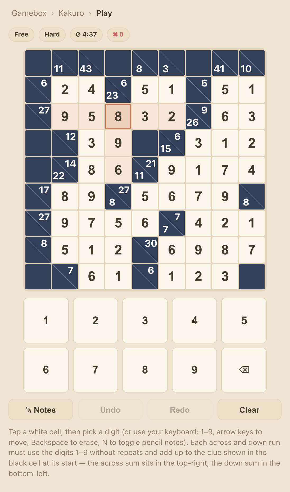

# Gamebox

A small browser-based collection of newspaper-style logic-puzzle games. It started as a recreation of The Economist's daily "inboxes" (Shikaku) puzzle and has since grown into a hub of games, each with unlimited auto-generated puzzles, a daily challenge, and personal stats.

## ▶️ Play

**[Play Gamebox →](https://matthewedwarddavidson.github.io/gamebox/)**

Pick a game from the hub:

- **Shikaku** — the classic [Shikaku](https://en.wikipedia.org/wiki/Shikaku)
  (as seen in The Economist's "inboxes"): partition the 8×12 grid into
  rectangles so each contains exactly one number equal to its area.
- **Battleships** — solitaire [Bimaru](<https://en.wikipedia.org/wiki/Battleship_(puzzle)>):
  locate the hidden fleet on a 10×10 grid using the ship counts along each row
  and column. Ships never touch, not even diagonally.
- **Train Tracks** — [Train Tracks](https://en.wikipedia.org/wiki/Train_Tracks_(puzzle)):
  lay one continuous, non-branching track between two fixed border stubs, using
  the counts of how many cells hold track in each row and column.
- **Kakuro** — [Kakuro](https://en.wikipedia.org/wiki/Kakuro), the numbers
  crossword: fill each run of white cells with the digits 1–9, no repeats, so
  that it adds up to the clue in the black cell at its start.

<!-- markdownlint-disable MD033 -->
<p><em>Shikaku</em><br />
</p>

<p><em>Battleships</em><br />
</p>

<p><em>Train Tracks</em><br />
</p>

<p><em>Kakuro</em><br />
</p>
<!-- markdownlint-enable MD033 -->

## How puzzles are generated

Every puzzle is produced deterministically from a numeric **seed**, so the
engines are pure functions of that seed and the same seed always yields the
exact same puzzle.

- **Shikaku** recursively splits the grid into rectangles, places one clue per
  rectangle, and verifies the clue set has a unique solution — retrying with
  new sub-seeds until it does.
- **Battleships** places a random fleet (respecting the no-touch rule), derives
  the row/column counts, then reveals the minimal set of hint cells needed to
  make the solution unique before adding a few extra hints based on difficulty.
- **Train Tracks** carves a random self-avoiding path between two border stubs,
  derives the row/column track counts, then reveals the minimal set of given
  pieces needed for a unique solution (plus a few extra on easier levels).
- **Kakuro** scatters black blocks over a grid (7×7 to 9×9) so every run is
  2–8 cells long and the white region is connected, fills it with digits that
  are distinct within each run, and derives the clue sums. It then anneals the
  digits until basic run-sum logic can resolve every cell, and finally checks
  with a solver that the solution is unique (blacking out any cell where a
  second solution disagrees).

This keeps things simple and serverless:

- Each game's **daily challenge** derives its seed (and difficulty) from the UTC
  date, so everyone plays the same puzzle each day and past days can be
  revisited without storing any puzzle data.
- **Free play** just picks a random seed, giving an effectively unlimited supply
  of puzzles.

## Project layout

- `src/shell/` — the multi-game shell: game registry, hub screen, optional
  accounts, and cross-game state. Persistence is pluggable via a
  `PersistenceProvider` (see `src/shell/persistence/`): a local IndexedDB store
  for guests and a Firestore store for signed-in users. In-progress saves for
  signed-in users are batched (one write a few seconds after the last move) to
  keep Firestore writes down.
- `src/shared/` — utilities shared by every game (e.g. the seeded RNG).
- `src/games/<game>/` — one folder per game, each self-contained with:
  - `engine/` — pure, DOM-free game logic: puzzle generation, solver
    (uniqueness verification), rules/validation, and the daily puzzle. Each
    generator exports a `GENERATOR_VERSION`: bump it whenever a change alters the
    puzzle a seed produces, so older in-progress saves are discarded rather than
    replayed against a different puzzle.
  - `store/` — Zustand game state plus persistence and stats.
  - `ui/` — React UI: home, board, and stats screens.

## Local development

<!-- markdownlint-disable MD033 -->
<details>
<summary>Running the project locally</summary>

```sh
make start      # install deps (if needed) and launch the dev server
```

Then open http://localhost:5173/.

Other commands:

```sh
make test       # run the test suite
make build      # type-check and build the production bundle
make preview    # serve the production build
make typecheck  # run the TypeScript type checker
make lint       # run ESLint over the source
make clean      # remove node_modules and dist
make help       # list all commands
```

</details>

## Continuous integration

<details>
<summary>How CI and deploys work</summary>

Every push and pull request runs linting, type-checking and the full test
suite via the [CI workflow](.github/workflows/ci.yml). The
[deploy workflow](.github/workflows/deploy.yml) also lints, type-checks and
tests before building, so only passing code is published to GitHub Pages.

</details>

## Accounts & cloud sync (optional)

<details>
<summary>Optional accounts, cloud sync and Firebase setup</summary>

By default the app is fully serverless and stores your progress locally in the
browser (IndexedDB). Optionally, it can offer accounts so you can keep your
data across devices and browsers:

- Anyone can play as a **guest** with no sign-in.
- Signing in with **Google** or **GitHub** enables cloud sync via Firebase
  (Firestore). Your existing guest data is merged into your account the first
  time you sign in — game history is unioned so nothing is lost.

Accounts are entirely opt-in at build time. If the `VITE_FIREBASE_*` variables
aren't set, the sign-in UI is hidden and the app runs in local-only guest mode.

### Enabling accounts (project owner)

1. Create a Firebase project at <https://console.firebase.google.com/>.
2. **Authentication → Sign-in method:** enable **Google** and **GitHub**
   providers. For GitHub, register an OAuth app and paste its client ID/secret;
   add the callback URL Firebase shows you.
3. **Firestore Database:** create a database in production mode, then set this
   security rule so each user can only read/write their own data, and so
   anonymous usage metrics can be written but never read back:

   ```
   rules_version = '2';
   service cloud.firestore {
     match /databases/{database}/documents {
       match /users/{uid}/{document=**} {
         allow read, write: if request.auth != null && request.auth.uid == uid;
       }

       // Cookieless usage analytics: create-only, never readable by clients.
       match /metrics/{doc} {
         allow read, update, delete: if false;
         allow create: if isValidMetric();
       }
     }

     function isValidMetric() {
       let d = request.resource.data;
       return d.type in ['visit', 'game_started', 'game_completed']
         && d.sid is string && d.sid.size() > 0 && d.sid.size() <= 64
         && d.keys().hasOnly(
           ['type', 'ts', 'sid', 'game', 'mode', 'difficulty', 'durationMs', 'won']
         );
     }
   }
   ```

4. **Authentication → Settings → Authorized domains:** add your GitHub Pages
   domain (e.g. `matthewedwarddavidson.github.io`).
5. Copy `.env.example` to `.env` and fill in the Web App config values
   (Project settings → General → Your apps → SDK setup & config). These are
   publishable client keys; access is controlled by the security rule above.
   (`.env` is git-ignored; tests always run unconfigured via the committed
   `.env.test`, so a local `.env` never affects them.)
6. For deploys, add the same values as repository secrets and expose them to the
   build step in the deploy workflow as `VITE_FIREBASE_*` environment variables.
7. **Content Security Policy:** the CSP in `index.html` allow-lists the Firebase
   domains (`firestore.googleapis.com`, the auth endpoints and the project's
   `*.firebaseapp.com` auth frame). If you use a different Firebase project,
   update the `frame-src` host to match your `authDomain`.

</details>

## Usage analytics

<details>
<summary>Cookieless usage metrics</summary>

When Firebase is configured, the app records lightweight, **cookieless** usage
metrics to a Firestore `metrics` collection. This is entirely separate from
accounts — it works for guests too and needs no extra setup beyond the Firebase
config and the `metrics` security rule above.

What's collected (all anonymous — no personal data, no cookies, no persistent
identifier):

- **Visits & sessions** — a per-tab session id kept in `sessionStorage` only. It
  is cleared when the tab closes and is not stored across visits, so there's no
  durable device identifier and no cross-session tracking.
- **Games started** and **games completed**, each tagged with the game type
  (`shikaku` / `battleships` / `traintracks` / `kakuro`), mode (`daily` / `free`) and difficulty.
- **Solve time** (`durationMs`) on completion.

From these events you can derive sessions, plays per game, difficulty
distribution and solve times; unique visitors are approximated by daily session
counts rather than a persistent id. The browser's **Do-Not-Track** signal is
respected — nothing is sent when it's enabled — and the collection is create-only
and read-locked, so events can't be scraped; read them in the Firebase console
(or via the Admin SDK). No config means no analytics, exactly like guest mode.

This deliberately mirrors the approach of banner-free tools like Cloudflare Web
Analytics and Plausible: because no cookie or persistent identifier is stored on
the device, it's designed to avoid needing a consent banner under UK/EU PECR.
Note that requests to Firestore expose the visitor's IP to Google (a processor),
so a short privacy note mentioning anonymous analytics and Firebase/Google is
still recommended.

</details>
<!-- markdownlint-enable MD033 -->
